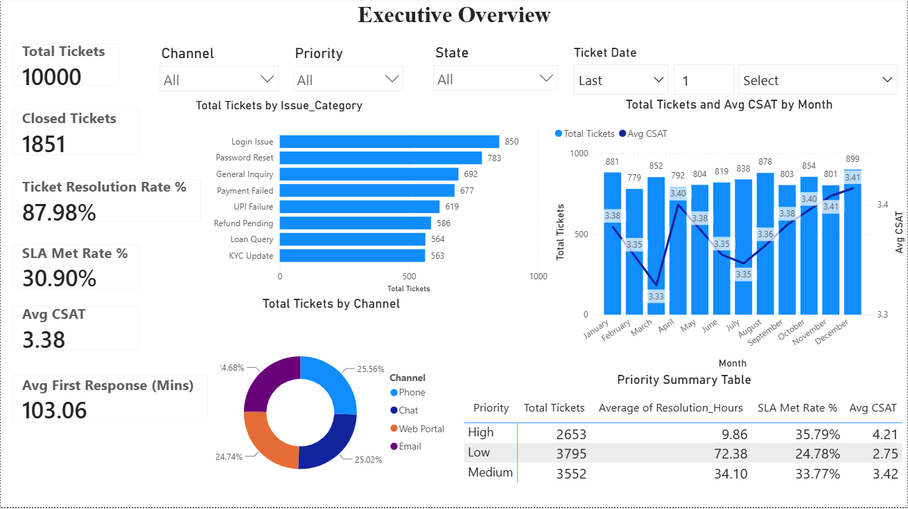
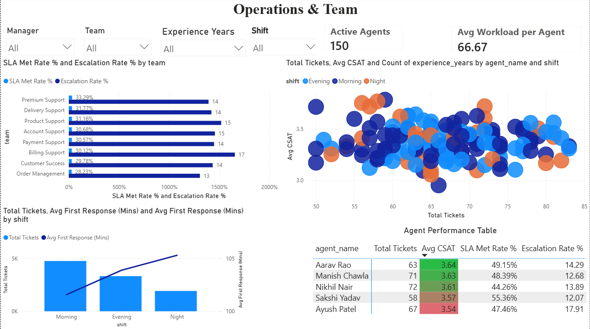
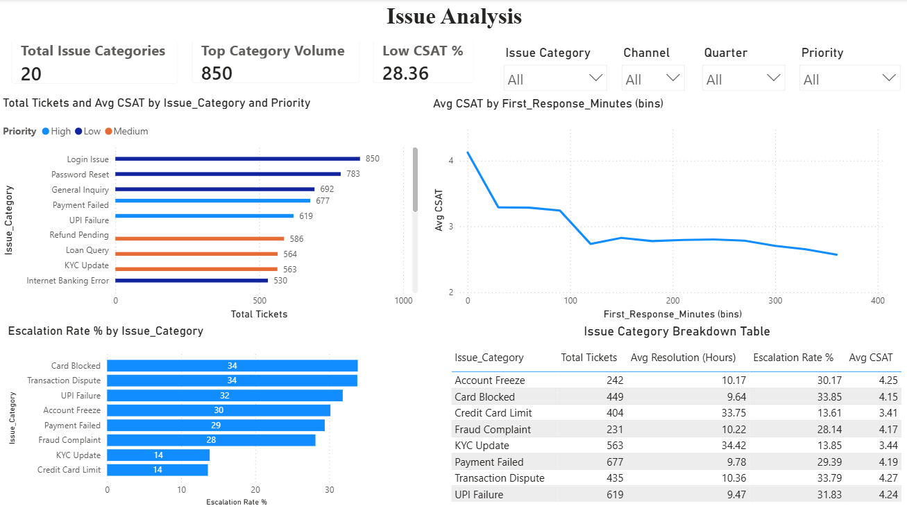
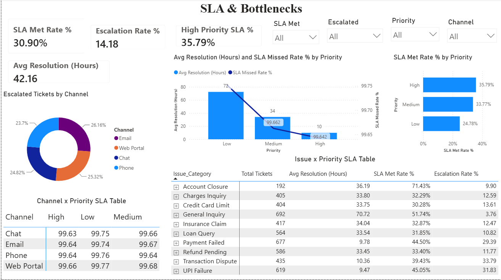
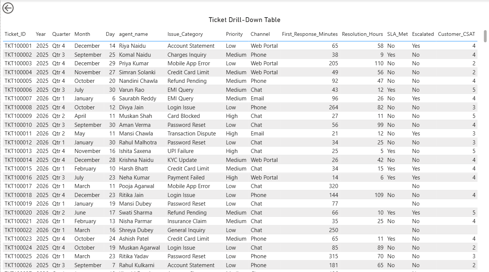

# Customer Support Operations Dashboard

**Type:** End-to-end analytics project — synthetic data generation → SQL analysis → Power BI dashboard
**Tools:** Python (pandas, Faker), MySQL, Power BI
**Author:** Unsi Rathod

---

## Business Problem

A retail bank's customer support operation needs visibility into how tickets move
through the system: which issue categories drive volume, whether agents and teams
are meeting SLA targets, where escalations concentrate, and how resolution speed
relates to customer satisfaction. This project simulates that environment end to
end — from raw ticket data to a decision-ready dashboard — the way a Reporting
Analyst would build it for a real support organization.

## Data

Synthetic but rule-driven, built to mirror the statistical patterns of real
support data rather than pure randomness:

- **`customer_support_tickets.csv`** — 10,000 tickets across 19 issue categories
  (e.g. UPI Failure, Card Blocked, KYC Update), 14 banking products, 4 channels,
  and 30 Indian cities. Each ticket carries priority, SLA target, first response
  time, resolution time, CSAT, escalation, and reopen flags.
- **`agent_master_indian.csv`** — 150 agents across 10 support teams, each with a
  team, manager, shift, location, and experience level.

Business rules encode realistic relationships instead of random noise:
priority and SLA hours are driven by issue category (e.g. Fraud Complaint = High
priority, 4-hour SLA), CSAT scores trend down as resolution time increases, and
escalation probability scales with priority (30% for High vs. 4% for Low).

## Process

1. **Data generation** (`business_rules.py`, `helper_functions.py`,
   `generate_tickets.py`, `generate_data.py`) — weighted-random ticket generation
   against the business rules above, using Faker for realistic Indian names,
   emails, and phone numbers.
2. **Data cleaning & validation** (`Data_cleaning.sql`) — duplicate checks, null
   checks on critical fields, SLA-logic consistency checks (resolution time vs.
   SLA hours vs. SLA_Met flag), CSAT range validation, and an agent-to-ticket
   join integrity check.
3. **Exploration** (`Data_exploration.sql`) — baseline distributions: status,
   priority, channel, team, date range, CSAT summary.
4. **KPI analysis** (`KPI_Analysis.sql`) — resolution rate, SLA achievement rate,
   escalation rate, reopen rate, and breakdowns by priority and channel.
5. **Operational analysis** (`Operational_Analysis.sql`) — team and agent
   performance, manager rollups, SLA breach analysis by issue category and
   priority, shift-wise and experience-wise performance.
6. **Ad hoc business questions** (`Adhoc_Business_Operations.sql`) — 15 targeted
   queries answering specific stakeholder questions (e.g. "which agents need
   coaching," "what are our high-risk tickets").
7. **Dashboard views** (`Dashboard_Dataset.sql`) — six reusable SQL views
   (`vw_support_kpi_summary`, `vw_monthly_ticket_trend`, `vw_team_performance`,
   `vw_agent_performance`, `vw_issue_category_analysis`, `vw_priority_analysis`)
   that feed the Power BI model directly, keeping the heavy aggregation logic in
   SQL rather than DAX.
8. **Power BI dashboard** (`Customer_support_analytics.pbix`) — a `_Measures` table of DAX
   measures sits alongside the two data tables, keeping the model organized.

## Dashboard Pages

| Page | Purpose |
|---|---|
| **Executive Overview** | Top-line KPIs (total tickets, resolution rate, SLA met rate, avg CSAT, avg first response), issue volume by category, channel mix, monthly trend |
| **Operations & Team** | Team-level SLA and escalation rates, agent workload vs. CSAT (scatter), shift performance, active agent count |
| **Issue Analysis** | Issue category volume and CSAT, escalation rate by category, CSAT vs. response time |
| **SLA & Bottlenecks** | SLA performance by priority and channel, high-priority SLA compliance, escalation breakdown |
| **Ticket Details** | Full drill-down ticket table for ad hoc investigation |

## Screenshots

### Executive Overview


### Operations & Team


### Issue Analysis


### SLA & Bottlenecks


### Ticket Details


## Key Findings

- **Resolution rate: 87.98%** of all tickets reach a Resolved or Closed state.
  (Note: an earlier version of this measure counted only `Status = "Closed"`,
  which understated resolution rate at ~18.5% — fixed to include `Resolved`
  as well, since `Closed` is a downstream archival state, not a separate
  outcome.)
- **SLA Met Rate: 30.9%** of tickets with a known SLA outcome met their SLA.
  This excludes the ~12% of tickets (1,202 of 10,000) still `Open`/`Pending`,
  where no SLA outcome exists yet — those are tracked separately rather than
  forced into a Yes/No bucket.
- **Highest-volume issue category: Login Issue**, 850 tickets.
- **Lowest-CSAT issue category: Internet Banking Error** (avg CSAT 2.74).
- **Escalation rate: 14.18%** overall; **Billing Support** has the highest
  team-level escalation rate at 16.57%, notably above the next-closest team
  (Product Support, 15.2%).
- **CSAT tracks first response time closely**: average CSAT falls from ~4.0
  for tickets responded to almost immediately down to ~2.8 for tickets with
  300+ minute first response times — a clean, monotonic relationship that's
  the strongest single insight in the dataset.

## Setup / Reproducing This Project

```bash
pip install -r requirements.txt
python scripts/generate_data.py       # builds agent_master_indian.csv
python scripts/generate_tickets.py    # builds customer_support_tickets.csv
```

Then import both CSVs into MySQL and run the scripts in `sql/` in this order:
`Data_cleaning.sql` → `Data_exploration.sql` → `KPI_Analysis.sql` →
`Operational_Analysis.sql` → `Adhoc_Business_Operations.sql` →
`Dashboard_Dataset.sql`. The last script creates the views the Power BI
dashboard connects to. Open `dashboard/Customer.pbix` and refresh the data
source to point at your local MySQL instance.

## Repository Structure

```
data/
  agent_master_indian.csv
  customer_support_tickets.csv
scripts/
  business_rules.py
  helper_functions.py
  generate_data.py
  generate_tickets.py
sql/
  Data_cleaning.sql
  Data_exploration.sql
  KPI_Analysis.sql
  Operational_Analysis.sql
  Adhoc_Business_Operations.sql
  Dashboard_Dataset.sql
dashboard/
  Customer.pbix
screenshots/
  executive_overview.png
  operations_team.png
  issue_analysis.png
  sla_bottlenecks.png
  ticket_details.png
requirements.txt
LICENSE
README.md
```

## License

This project is licensed under the MIT License — see [LICENSE](LICENSE) for details.
